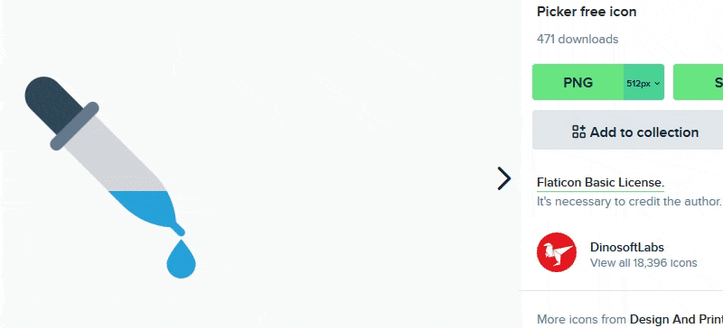

# Keypirinha ColorPicker
[Keypirinha](http://keypirinha.com/) plugin to grab the color code of the pixel under the mouse.

## Usage

Type the trigger keyword "Color pick:" (customisable in package config) to grad the pixel color under your pointer. Color code can be copied to clipboard in 5 formats :
* hexadecimal (eg. `#e36209`)
* RGB (eg. `227, 98, 9`)
* CMYK (eg. `0%, 57%, 96%, 11%`)
* HSV (eg. `24°, 96%, 89%`)
* HSL (eg. `24°, 92%, 46%`)

> :information_source: If you want to pick another color, simply type a space in the searchbox to refresh suggestions.

## Installation

* Download the file `ColorPicker.keypirinha-package` from the releases tab
* Copy the file into %APPDATA%\Keypirinha\InstalledPackages (installed mode) or <Keypirinha_Home>\portable\Profile\InstalledPackages (portable mode)

## Possible improvements (not planned)
* Live refresh (tried, but I encountered difficulties with suggestions refresh)
* Suggest nearby pixels (3*3 square around the current position for example)
* Add a color converter

## Acknowledgements
Code structure and readme are inspired by ueffel's [kill plugin](https://github.com/ueffel/Keypirinha-Plugin-Kill)

Icon made by [DinosoftLabs](https://www.flaticon.com/authors/dinosoftlabs) from [www.flaticon.com](https://www.flaticon.com/)